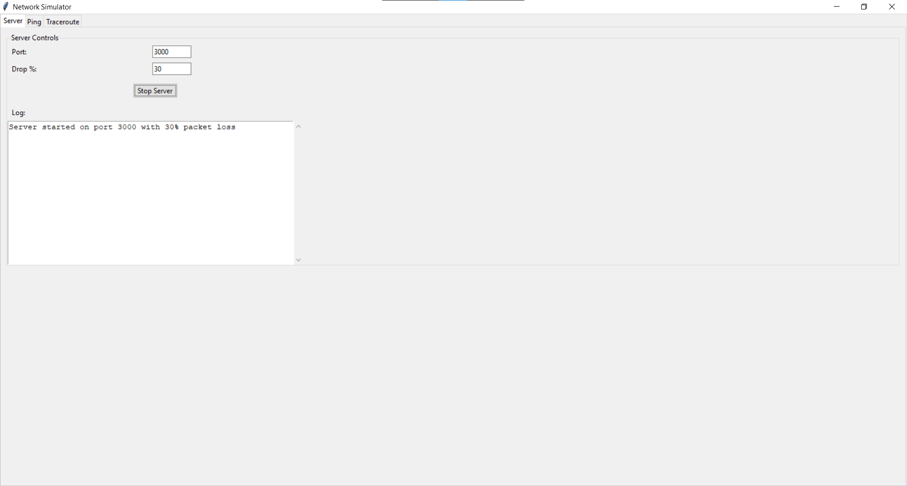
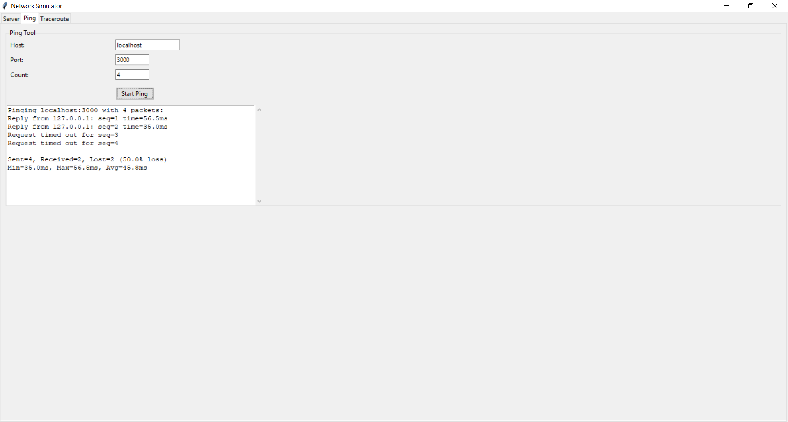
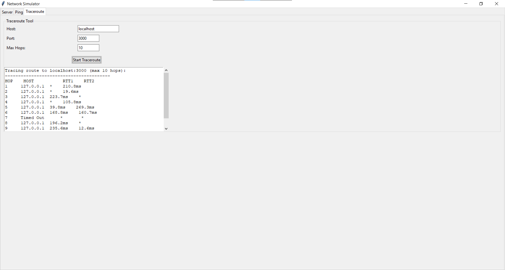

# Network Diagnostic Tools Simulator

This project implements a set of network diagnostic tools similar to ping and traceroute, designed as a UDP-based simulation with a custom server. The tools demonstrate fundamental networking concepts and provide both command-line and graphical interfaces for interacting with the simulated network environment.

## Contents

- [Overview](#overview)
- [Features](#features)
- [Project Structure](#project-structure)
- [Installation](#installation)
- [Usage](#usage)
- [Technical Details](#technical-details)

## Overview

This application simulates network diagnostic tools including ping and traceroute over UDP instead of using ICMP packets. It includes both command-line interfaces and a graphical UI, allowing users to explore networking concepts like packet loss, timeouts, and round-trip time calculation in a controlled environment.

## Features

- **Custom UDP Server** that simulates network behavior with configurable packet loss
- **Ping Simulator** with statistics collection and timeout handling
- **Traceroute Simulator** that traces packet routes with TTL values
- **Graphical User Interface** with separate tabs for server control, ping, and traceroute
- **Command-line Clients** for both ping and traceroute simulations
- **Network Behavior Simulation** including random packet loss and variable latency

## Project Structure

```
ASSIGNMENT-2/
├── GUI/
│   └── Networking_Tool.py      # GUI application
├── ping-simulation/
│   ├── client.py               # Ping client
│   └── server.py               # Ping server
├── tracert-simulation/
│   ├── client.py               # Traceroute client
│   └── server.py               # Traceroute server
```

## Installation

1. Ensure you have Python 3.6 or higher installed
2. No additional dependencies required beyond Python's standard library

## Usage

### GUI Application

Run the graphical interface to access all tools in one application:

```
python GUI/Networking_Tool.py
```

The GUI provides three tabs:
- **Server**: Control the server, set port and packet drop rate
- **Ping**: Test connectivity to a host with configurable parameters
- **Traceroute**: Trace the route to a destination with hop-by-hop analysis

### Command-line Tools

#### Ping Client

```
python ping-simulation/client.py [host] [-r COUNT] [-w TIMEOUT]
```

Options:
- `host`: Target hostname or IP (default: localhost)
- `-r, --count`: Number of packets to send (default: 4)
- `-w, --timeout`: Timeout in seconds (default: 2.0)

#### Traceroute Client

```
python tracert-simulation/client.py
```

Default settings:
- Target: localhost
- Maximum hops: 30
- Port: 3000

### Server

Start the server separately for command-line usage:

```
python ping-simulation/server.py   # For ping simulation
```

or

```
python tracert-simulation/server.py   # For traceroute simulation
```

## Technical Details

- **Socket Programming**: Uses UDP sockets to simulate network behavior
- **Packet Loss Simulation**: Randomly drops packets to mimic unreliable networks
- **Latency Simulation**: Adds random delays to simulate network latency
- **Multi-threading**: Separates UI and network operations with threading
- **Exception Handling**: Robust error handling for network issues and timeouts

## How It Works

### Ping Simulation
The ping simulation works by sending UDP packets with sequence numbers to the server. The server responds with a reply containing the same sequence number. The client measures the time between sending and receiving to calculate the round-trip time (RTT). The server can be configured to randomly drop packets, simulating packet loss on a real network.

### Traceroute Simulation
The traceroute simulation sends UDP packets with increasing TTL (Time To Live) values to trace the route to a destination. The server responds with the TTL value it received. By analyzing these responses, the client can determine the path packets take and measure the latency at each hop.



